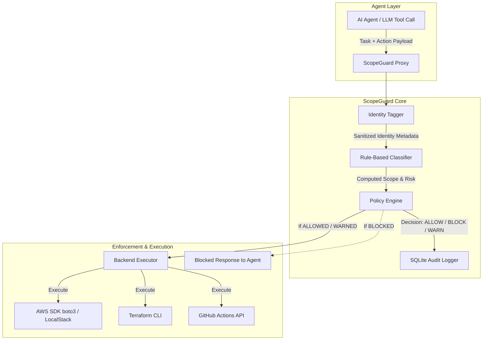

# ScopeGuard — System Architecture

The following diagram illustrates the high-level architecture of ScopeGuard, sitting as an intercepting proxy between AI Agent tool calls and cloud infrastructure backend APIs.

## Component Responsibilities

1. **Identity Tagger (`proxy/identity.py`)**: Extracts agent ID, session ID, declared task, and reasoning excerpt; strips any credentials or secrets from parameters (NFR5).
2. **Task-to-Scope Classifier (`proxy/classifier.py`)**: Keyword and rule-based classifier computing allowable AWS permissions from natural language task description (FR3).
3. **Policy Engine (`proxy/policy.py`)**: Evaluates tool calls against computed scope with 3 ablation modes (`full`, `tagging_only`, `passthrough`) and fail-closed security guarantees (FR4, NFR2).
4. **Backend Executor (`proxy/executor.py`)**: Routes calls to LocalStack, AWS, or Terraform CLI endpoints with latency tracking (NFR3).
5. **Audit Logger (`proxy/audit.py`)**: Persists structured audit records with indexed querying capabilities (FR5, FR6).
