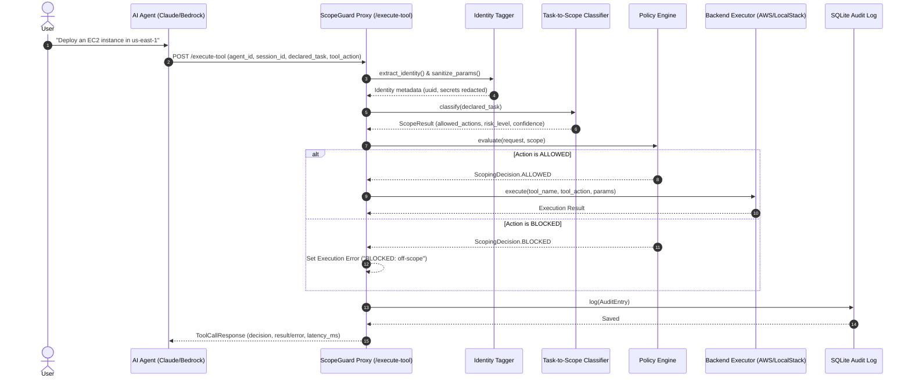

# ScopeGuard — Request Sequence Diagram

The following sequence diagram details the complete interception, classification, policy evaluation, execution, and audit logging flow for every tool call handled by ScopeGuard.

